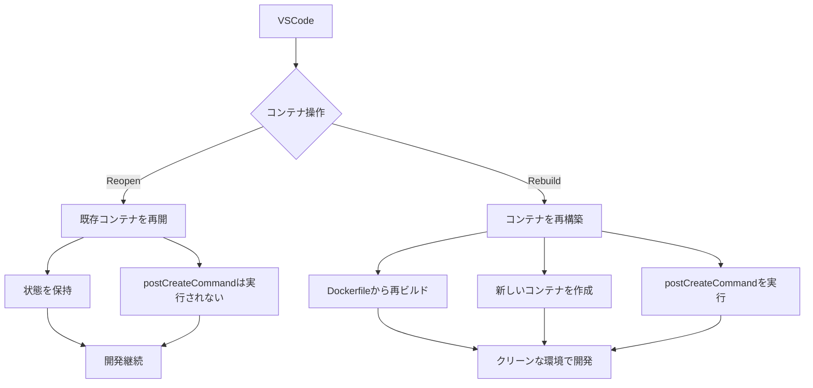
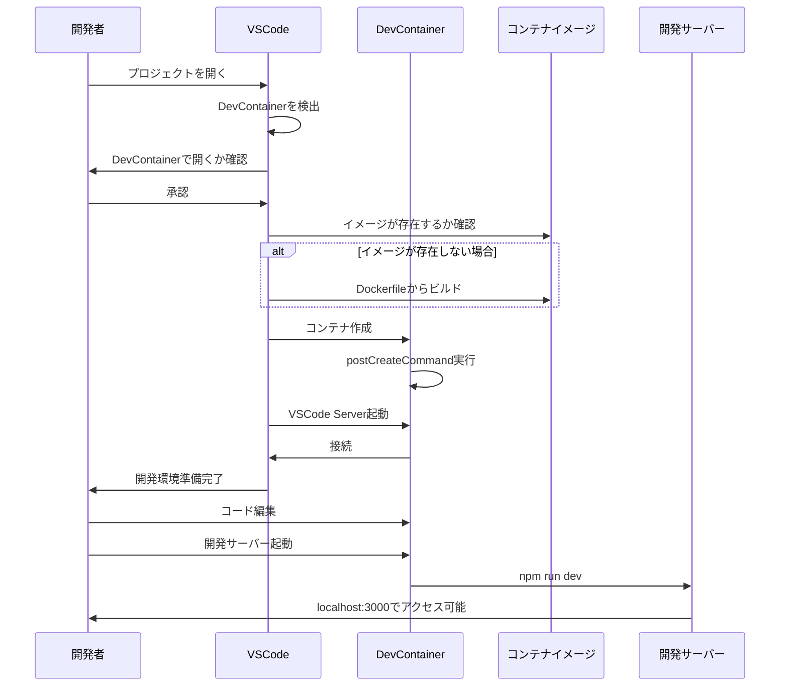

# 開発コンテナ（DevContainer）環境の解説

## 目次

- [概要](#概要)
- [1. Dockerfile](#1-dockerfile)
  - [基本環境の設定](#基本環境の設定)
  - [ディレクトリとユーザー設定](#ディレクトリとユーザー設定)
  - [依存関係のインストール](#依存関係のインストール)
  - [コンテナ起動設定](#コンテナ起動設定)
- [2. docker-compose.yml](#2-docker-composeyml)
  - [基本設定](#基本設定)
  - [サービス設定の詳細](#サービス設定の詳細)
  - [ネットワーク定義](#ネットワーク定義)
- [3. devcontainer.json](#3-devcontainerjson)
  - [基本設定](#基本設定-1)
  - [VSCode固有の設定](#vscode固有の設定)
  - [環境設定](#環境設定)
- [4. 各設定の詳細解説](#4-各設定の詳細解説)
  - [開発コンテナの階層構造](#開発コンテナの階層構造)
  - [ユーザー設定の各層での役割](#ユーザー設定の各層での役割)
  - [ボリュームマウントの詳細](#ボリュームマウントの詳細)
  - [ポート転送の重複設定](#ポート転送の重複設定)
  - [package.jsonと依存関係管理](#packagejsonと依存関係管理)
  - [ネットワーク設定詳細](#ネットワーク設定詳細)
  - [コンテナの永続化](#コンテナの永続化)
  - [ファイル権限の設定](#ファイル権限の設定)
  - [コンテナの再開と再構築](#コンテナの再開と再構築)
- [IaC (Infrastructure as Code) としての側面](#iac-infrastructure-as-code-としての側面)
- [開発サーバーとの関係](#開発サーバーとの関係)
- [開発フロー](#開発フロー)
- [DevContainerセットアップチェックリスト](#devcontainerセットアップチェックリスト)
- [まとめ](#まとめ)

## 概要

開発コンテナとは、VSCodeで開発を行うための一貫した環境をDockerを使って提供する仕組みです。以下の3つの主要ファイルによって階層的に構成されています：

- **Dockerfile**: コンテナのOS環境とシステムレベルの設定を定義（基盤レイヤー）
- **docker-compose.yml**: 複数コンテナの構成と連携を定義（アーキテクチャレイヤー）
- **devcontainer.json**: VSCodeの開発環境とプロジェクト固有の設定を定義（IDE連携レイヤー）

これらは階層構造を成しており、下位レイヤーが上位レイヤーの基盤となります：
1. Dockerfileでイメージ（設計図）を定義
2. docker-compose.ymlでイメージからコンテナを作成・実行し連携を設定
3. devcontainer.jsonでVSCodeとコンテナの統合環境を構築し、**コンテナ内をVSCodeから直接操作可能に**

これらは合わせて「開発環境のIaC（Infrastructure as Code）」を実現しています。

## 1. Dockerfile

このファイルはコンテナの基本環境を定義します：

```dockerfile
FROM node:18-slim

# 必要最小限のツールのみインストール
RUN apt-get update && \
    apt-get install -y git curl && \
    apt-get clean && \
    rm -rf /var/lib/apt/lists/*

# 作業ディレクトリの作成と権限設定
RUN mkdir -p /workspace/frontend && \
    chown -R node:node /workspace && \
    chmod -R 755 /workspace

WORKDIR /workspace/frontend

# package.jsonとpackage-lock.jsonをコピー
COPY --chown=node:node frontend/package*.json ./

# nodeユーザーに切り替え
USER node

# 依存関係をインストール（グローバルインストールを避け、プロジェクトの依存関係として管理）
RUN npm install

# コンテナ内での実行コマンド
CMD ["sleep", "infinity"] 
```

### 基本環境の設定
- `FROM node:18-slim`: 軽量なNode.js 18イメージを使用（slim=最小限のパッケージのみ含む）。
- `apt-get install`: 必要最小限のツールのみをインストール（git, curl）。
- `apt-get clean` と `rm -rf /var/lib/apt/lists/*`: パッケージインストール後の不要なキャッシュとインデックスファイルを削除してイメージサイズを最小化。

### ディレクトリとユーザー設定
- `mkdir -p /workspace/frontend`: 必要なディレクトリ構造を再帰的に作成。
- `chown -R node:node /workspace`: ディレクトリの所有者をnodeユーザーとnodeグループに設定。
- `chmod -R 755 /workspace`: ディレクトリに適切な権限を設定（所有者に読み書き実行権限、グループとその他ユーザーに読み取りと実行権限）。
- `WORKDIR /workspace/frontend`: コンテナ内の作業ディレクトリを設定。
- `COPY --chown=node:node`: ファイルコピー時に所有権を明示的に設定（重要なセキュリティ対策）。
- `USER node`: 非rootユーザーとして実行（セキュリティのベストプラクティス）。

#### nodeユーザーについて
`chown -R node:node /workspace`は、rootユーザーとrootグループに与えられていた所有権をnodeユーザーとnodeグループに付け替える操作です：

- nodeユーザーは手動で作成する必要はありません。`FROM node:18-slim`で使用している公式Node.jsイメージにデフォルトで含まれています
- これはセキュリティのベストプラクティスの一部で、コンテナ内の操作を非root権限で行うためのものです
- 最初にroot権限で必要なセットアップを行った後、`USER node`コマンドで通常操作を制限された権限で実行します

### 依存関係のインストール
- `RUN npm install`: package.jsonに記載されている依存関係をすべてインストール。
- グローバルインストール（`npm install -g`）は避け、プロジェクト依存関係としてインストール。
- TypeScriptや型定義なども必要ならpackage.jsonに記載し、ここでまとめてインストールする。

### コンテナ起動設定
- `CMD ["sleep", "infinity"]`: コンテナを常に起動状態に保つためのコマンド。コンテナ起動時に実行され、これによりコンテナがバックグラウンドで動作し続ける。

## 2. docker-compose.yml

このファイルは複数のコンテナサービスを一元管理（複数のコンテナをどのように起動し、どのように連携させるか）し、それらの関係性を定義します：

```yaml
version: '3.8'

services:
  frontend:
    build: 
      context: .
      dockerfile: ./frontend/.devcontainer/Dockerfile
    volumes:
      - .:/workspace:cached
      - /workspace/frontend/node_modules
    command: sleep infinity
    environment:
      - NODE_ENV=development
      - NEXT_PUBLIC_OPENAI_API_KEY=
    ports:
      - "3000:3000"
    networks:
      - mailcraft-network
    user: node

networks:
  mailcraft-network:
    driver: bridge 
```

### 基本設定
- `version`: Docker Composeファイルのバージョンを指定。バージョンによって機能や構文が異なります。
- `services`: アプリケーションを構成する各コンテナサービスを定義。ここでは`frontend`という名前の単一サービスが定義されています。
- `networks`: コンテナ間の通信に使用されるネットワークを定義。`mailcraft-network`という名前のブリッジネットワークを作成しています。

### サービス設定の詳細
#### ビルド設定
- `build`: Dockerfileからイメージを構築するための設定。
  - `context: .`: ビルドコンテキストとしてプロジェクトルートディレクトリを指定。これにより、下記のDockerfileからプロジェクト全体にアクセス可能になります。
  - `dockerfile: ./frontend/.devcontainer/Dockerfile`: 使用するDockerfileのパスを指定。プロジェクトルートからの相対パスで指定します。

#### ボリューム設定
- `volumes`: ホストとコンテナ間のディレクトリマッピング。
  - `.:/workspace:cached`: プロジェクトルート全体をコンテナ内の`/workspace`にマウント。双方向のファイル同期が行われる。
  - `/workspace/frontend/node_modules`: 匿名ボリュームの設定。コンテナ内の`node_modules`ディレクトリを保護する。

#### 実行設定
- `command: sleep infinity`: コンテナ起動時に実行するコマンド。
  - Dockerfileの`CMD`指示を上書きします。
  - `sleep infinity`は、コンテナを常に起動状態に保つための無限ループコマンド。

#### 環境変数設定
- `environment`: コンテナ内で使用する環境変数を設定。
  - `NODE_ENV=development`: Node.jsアプリケーションの実行モードを開発モードに設定。
  - `NEXT_PUBLIC_OPENAI_API_KEY=`: OpenAI APIのキーを設定するための変数（値は空で定義）。

#### ポート設定
- `ports`: ホストとコンテナのポートマッピング。
  - `"3000:3000"`: ホストの3000ポートをコンテナの3000ポートに転送。

#### ネットワーク設定
- `networks`: このサービスが接続するネットワークを指定。
  - `mailcraft-network`: 他のサービスとの通信に使用するカスタムネットワーク。

#### ユーザー設定
- `user: node`: コンテナ内でプロセスを実行するユーザーを指定。

### ネットワーク定義
- `networks`: プロジェクト全体で使用するネットワークを定義。
  - `mailcraft-network`: ネットワーク名。
  - `driver: bridge`: ネットワークタイプとしてブリッジを使用。同一ホスト上のコンテナが相互に通信できる最も一般的な方法。

## 3. devcontainer.json

このファイルはVSCodeの開発コンテナ機能のための設定ファイルです。主な設定項目の解説を以下に示します：

```json
{
  "name": "MailCraft AI Frontend",
  "dockerComposeFile": ["../../docker-compose.yml"],
  "service": "frontend",
  "workspaceFolder": "/workspace/frontend",
  "customizations": {
    "vscode": {
      "extensions": [
        "dbaeumer.vscode-eslint",
        "esbenp.prettier-vscode",
        "bradlc.vscode-tailwindcss",
        "dsznajder.es7-react-js-snippets",
        "ms-vscode.vscode-typescript-next"
      ],
      "settings": {
        "editor.formatOnSave": true,
        "editor.defaultFormatter": "esbenp.prettier-vscode",
        "editor.codeActionsOnSave": {
          "source.fixAll.eslint": true
        },
        "typescript.tsdk": "node_modules/typescript/lib",
        "tailwindCSS.includeLanguages": {
          "typescript": "javascript",
          "typescriptreact": "javascript"
        }
      }
    }
  },
  "forwardPorts": [3000],
  "remoteUser": "node"
}
```

### 基本設定
- `name`: コンテナの名前。VSCodeのリモートコンテナリストに表示される。
- `dockerComposeFile`: 使用するDocker Composeファイルのパス。
- `service`: Docker Composeファイル内のどのサービスに接続するか。
- `workspaceFolder`: コンテナ内のプロジェクトの作業ディレクトリ。

### VSCode固有の設定
- `customizations.vscode.extensions`: 自動的にインストールされるVSCode拡張機能。
  - コード品質ツール（ESLint, Prettier）
  - フレームワークサポート（Tailwind CSS, React）
  - 言語サポート（TypeScript）
- `customizations.vscode.settings`: VSCodeのエディタ設定（settings.jsonと同等）。
  - 保存時の自動フォーマット設定
  - デフォルトフォーマッタの設定
  - TypeScriptの設定
  - CSS言語サポートの設定

### 環境設定
- `forwardPorts`: コンテナからホストに転送するポート（ブラウザでアクセスするため）。
- `remoteUser`: コンテナ内で使用するユーザー名。

## 4. 各設定の詳細解説

### 開発コンテナの階層構造

3つのファイルは明確な階層構造を形成しています：

1. **Dockerfile**（基盤レイヤー）
   - **役割**: イメージを「定義・構築」する（設計図の作成）
   - **実行タイミング**: イメージビルド時

2. **docker-compose.yml**（アーキテクチャレイヤー）
   - **役割**: イメージから「コンテナを作成・実行」し、複数コンテナの連携を定義する
   - **実行タイミング**: `docker-compose up`コマンドまたはVSCodeのDevContainer起動時

3. **devcontainer.json**（IDE連携レイヤー）
   - **役割**: VSCodeとコンテナを統合し、開発体験を向上させる
   - **実行タイミング**: VSCodeがDevContainerを起動する時

### コマンド重複の理由

Dockerfileの`CMD ["sleep", "infinity"]`とdocker-composeの`command: sleep infinity`は同様の目的を持ちますが、次の理由で重複して定義されています：

1. 異なる実行コンテキスト（Dockerfile単体での使用とdocker-compose環境での使用）に対応するため
2. DevContainerを単一Dockerfileのみで使用する場合のフォールバック設定として
3. コンテナを常に起動状態に保つために両環境でも確実に設定するため

### ユーザー設定の各層での役割

各ファイルでのユーザー設定には、それぞれ異なる目的と適用範囲があります：

1. **Dockerfileの `USER node`**
   - **適用タイミング**: イメージビルド時
   - **影響範囲**: このイメージから作られる全てのコンテナ
   - **主な役割**: npm installなどのビルド時コマンドをnodeユーザーで実行

2. **docker-compose.ymlの `user: node`**
   - **適用タイミング**: コンテナ起動時
   - **影響範囲**: Docker Composeで管理されるコンテナ実行プロセス
   - **主な役割**: コンテナ実行時のユーザーを明示的に指定（Dockerfileの設定を確認または上書き）

3. **devcontainer.jsonの `remoteUser: "node"`**
   - **適用タイミング**: VSCodeがコンテナに接続時
   - **影響範囲**: VSCodeのセッションと操作
   - **主な役割**: VSCode上でのファイル編集・作成時の所有者とターミナルセッション

これらの設定は冗長に見えますが、それぞれ異なる文脈で機能し、どのような方法でコンテナを実行・操作しても常に`node`ユーザーで一貫した環境を保証します。

### ボリュームマウントの詳細

Docker Composeのボリューム設定には、重要な意味があります：

```yaml
volumes:
  - .:/workspace:cached
  - /workspace/frontend/node_modules
```

#### バインドマウント（`.:/workspace:cached`）
- **動作**: ホスト側のプロジェクトディレクトリとコンテナ内の`/workspace`ディレクトリを**双方向で同期**
- **目的**: ホスト側で編集したコードをコンテナ内に反映し、コンテナが削除されてもコードが保持される
- **`:cached`オプション**: ホストからコンテナへの読み取りパフォーマンスを優先し、わずかな遅延を許容して最適化

#### 匿名ボリューム（`/workspace/frontend/node_modules`）
- **動作**: コンテナ内の特定パスをホストのマウントから除外し、Docker管理の領域として確保
- **目的**: コンテナ内でインストールした`node_modules`を保持し、ホスト側のファイルシステムと分離
- **必要性**: 
  1. パフォーマンス向上（大量の小さなファイルの同期を避ける）
  2. プラットフォーム依存の問題回避（ネイティブモジュールの互換性）
  3. ホスト側に`node_modules`がない場合でもコンテナ内の依存関係を保持

### ポート転送の重複設定

Docker Composeの`ports`とdevcontainer.jsonの`forwardPorts`は機能的に重複していますが、異なる目的で存在します：

```yaml
# docker-compose.yml
ports:
  - "3000:3000"
```

```json
// devcontainer.json
"forwardPorts": [3000]
```

#### 重複がある理由
1. **異なる実行環境に対応**:
   - Docker Composeだけで実行する場合と、VSCode DevContainerで実行する場合の両方をサポート
2. **柔軟性の向上**:
   - どちらの方法でプロジェクトを起動しても同じ体験が得られるよう配慮
3. **フォールバック機能**:
   - 一方の設定が不足していても、もう一方で機能する

### package.jsonと依存関係管理

開発環境ではpackage.jsonが依存関係管理の中心となります：

1. **Dockerfileの`RUN npm install`**:
   - package.jsonに記載されたすべての依存関係（productionとdev）をインストール
   - 追加で個別パッケージを指定する必要はない（例：`typescript`や`@types/node`など）

2. **プロジェクト固有の依存関係**:
   - package.jsonに必要なパッケージが記載されていれば、自動的にインストールされる
   - チーム開発では、package.jsonがGitで共有されるため、環境の一貫性が保たれる

3. **グローバルパッケージを避ける利点**:
   - プロジェクト間の独立性を高める
   - バージョン管理が容易になる
   - 環境の再現性が向上する

### ネットワーク設定詳細

Docker Composeで定義したネットワークには複数の選択肢があります：

```yaml
networks:
  mailcraft-network:
    driver: bridge
```

#### 主なネットワークドライバー
1. **`bridge`** (デフォルト):
   - 同一ホスト上のコンテナ間通信に最適
   - 仮想ネットワークブリッジを作成し、コンテナ間のルーティングを管理
   - 最も一般的で、多くの用途に適している

2. **`host`**:
   - コンテナがホストのネットワークを直接使用
   - 高いパフォーマンスが必要な場合に使用
   - セキュリティ分離性が低下するため注意が必要

3. **`overlay`**:
   - 複数のDocker hostsにまたがるネットワーク
   - Docker Swarmやクラスター環境で使用
   - マイクロサービスアーキテクチャに適している

4. **`macvlan`**:
   - コンテナに物理ネットワークインターフェースのようなMACアドレスを割り当て
   - レガシーアプリケーションの移行に有用

5. **`none`**:
   - ネットワーク接続を持たないコンテナ作成
   - 完全に分離されたコンテナが必要な場合に使用

#### 複数サービスの将来的な拡張
現在はフロントエンドサービスのみですが、ネットワーク設定を先に行うことで、バックエンドやデータベースなどのサービスを追加する際にスムーズに連携できます。

### コンテナの永続化
- `CMD ["sleep", "infinity"]`: コンテナを終了せずに稼働し続けるためのコマンド。
- Dockerコンテナはメインプロセスが終了すると自動的に停止するため、これによりコンテナを継続的に実行。

### ファイル権限の設定
```
RUN mkdir -p /workspace/frontend && \
    chown -R node:node /workspace && \
    chmod -R 755 /workspace
```
- `mkdir -p`: 必要なディレクトリ構造を作成。
- `chown`: ディレクトリの所有者をnodeユーザーとnodeグループに設定。
- `chmod`: 適切な権限を設定（所有者に完全な権限、グループとその他のユーザーには読み取りと実行権限）。

### コンテナの再開と再構築



- **Reopen**: 既存のコンテナを再開。設定は保持され、`postCreateCommand`は実行されない。
- **Rebuild and Reopen**: コンテナを再構築。Dockerfileから再ビルドし、`postCreateCommand`も再実行される。

## IaC (Infrastructure as Code) としての側面

- Dockerfileは「OSレベルの前提環境」のIaC
- devcontainer.jsonは「開発のための前提環境」のIaC
- これらを組み合わせることで、コードで開発環境を定義・管理できる
- チーム全体で一貫した開発環境を実現し、「動かない」問題を解消

## 開発サーバーとの関係

開発サーバー（npm run dev等）は、通常以下のように扱われます：

1. 基本的には手動で起動（フレキシビリティを確保）
2. 必要に応じて `postStartCommand` で自動起動も可能
3. デバッグ実行時にはデバッグ設定に従い起動
4. `forwardPorts` 設定によりホストからアクセス可能

## 開発フロー



## DevContainerセットアップチェックリスト

以下は新しいプロジェクトでDevContainerを設定する際のチェックリストです：

- [ ] `.devcontainer`ディレクトリを作成
- [ ] `devcontainer.json`の作成
  - [ ] 適切な名前の設定
  - [ ] Docker Composeファイルの指定（または直接Dockerfileの指定）
  - [ ] 作業ディレクトリの設定
  - [ ] 必要なVSCode拡張機能の指定
  - [ ] VSCodeの設定の指定
  - [ ] 転送ポートの設定
  - [ ] remoteUserの設定
- [ ] `Dockerfile`の作成
  - [ ] 適切なベースイメージの選択
  - [ ] 必要なシステムツールのインストール
  - [ ] 作業ディレクトリの設定
  - [ ] 適切な権限設定
  - [ ] 非rootユーザーの使用
- [ ] `docker-compose.yml`の設定
  - [ ] ボリュームマウントの正しい設定
  - [ ] ポート転送の設定
  - [ ] 環境変数の設定
  - [ ] ネットワーク設定
  - [ ] ユーザー設定
- [ ] `.gitignore`に`node_modules`などの不要ファイルを追加
- [ ] チームメンバーへの共有と利用方法の説明

## まとめ

DevContainerは、「環境構築」と「開発体験」を一貫性を持って提供する強力なツールです。「環境が違うから動かない」という問題を解決し、新メンバーのオンボーディングを簡単にします。

最小限の設定で最大の効果を得るために、重複を減らし、ベストプラクティスに従った設定を心がけましょう。特にDockerfileでは必要最小限のツールのみをインストールし、依存関係はpackage.jsonを中心に管理することで、メンテナンス性と再現性が向上します。 