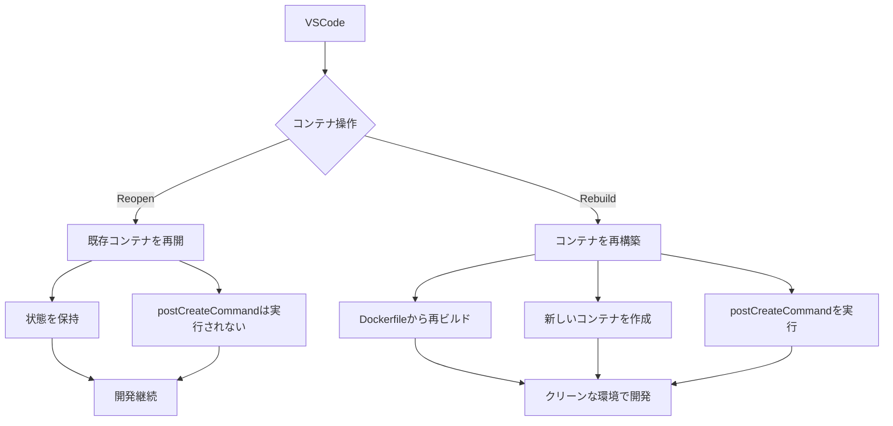
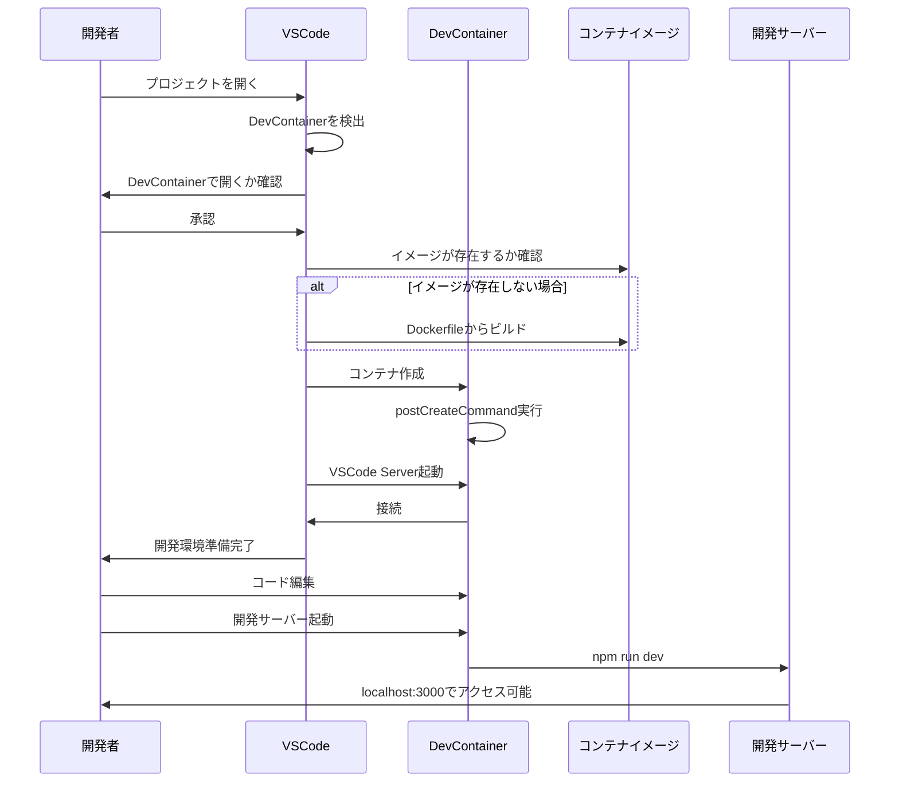

# 開発コンテナ（DevContainer）環境の解説

## 目次

- [概要](#概要)
- [1. devcontainer.json](#1-devcontainerjson)
  - [基本設定](#基本設定)
  - [VSCode固有の設定](#vscode固有の設定)
  - [環境設定](#環境設定)
- [2. Dockerfile](#2-dockerfile)
  - [基本環境の設定](#基本環境の設定)
  - [ディレクトリとユーザー設定](#ディレクトリとユーザー設定)
  - [コンテナ起動設定](#コンテナ起動設定)
- [各設定の詳細解説](#各設定の詳細解説)
  - [postCreateCommand](#postcreatecommand)
  - [remoteUser](#remoteuser)
  - [Dockerfileのグローバルパッケージとdevcontainerの違い](#dockerfileのグローバルパッケージとdevcontainerの違い)
  - [コンテナの永続化](#コンテナの永続化)
  - [ファイル権限の設定](#ファイル権限の設定)
  - [コンテナの再開と再構築](#コンテナの再開と再構築)
- [IaC (Infrastructure as Code) としての側面](#iac-infrastructure-as-code-としての側面)
- [開発サーバーとの関係](#開発サーバーとの関係)
- [開発フロー](#開発フロー)
- [DevContainerセットアップチェックリスト](#devcontainerセットアップチェックリスト)
- [まとめ](#まとめ)

## 概要

開発コンテナとは、VSCodeで開発を行うための一貫した環境をDockerを使って提供する仕組みです。以下の2つの主要ファイルによって構成されています：

- **Dockerfile**: コンテナのOS環境とシステムレベルの設定を定義
- **devcontainer.json**: VSCodeの開発環境とプロジェクト固有の設定を定義

これらは合わせて「開発環境のIaC（Infrastructure as Code）」を実現しています。

## 1. devcontainer.json

このファイルはVSCodeの開発コンテナ機能のための設定ファイルです。主な設定項目の解説を以下に示します：

```json
{
  "name": "MailCraft AI Frontend",
  "dockerComposeFile": ["../../docker-compose.yml"],
  "service": "frontend",
  "workspaceFolder": "/workspace/frontend",
  "customizations": {
    "vscode": {
      "extensions": [
        "dbaeumer.vscode-eslint",
        "esbenp.prettier-vscode",
        "bradlc.vscode-tailwindcss",
        "dsznajder.es7-react-js-snippets",
        "ms-vscode.vscode-typescript-next"
      ],
      "settings": {
        "editor.formatOnSave": true,
        "editor.defaultFormatter": "esbenp.prettier-vscode",
        "editor.codeActionsOnSave": {
          "source.fixAll.eslint": true
        },
        "typescript.tsdk": "node_modules/typescript/lib",
        "tailwindCSS.includeLanguages": {
          "typescript": "javascript",
          "typescriptreact": "javascript"
        }
      }
    }
  },
  "forwardPorts": [3000],
  "postCreateCommand": "npm install",
  "remoteUser": "node"
}
```

### 基本設定
- `name`: コンテナの名前。VSCodeのリモートコンテナリストに表示される。
- `dockerComposeFile`: 使用するDocker Composeファイルのパス。
- `service`: Docker Composeファイル内のどのサービスに接続するか。
- `workspaceFolder`: コンテナ内のプロジェクトの作業ディレクトリ。

### VSCode固有の設定
- `customizations.vscode.extensions`: 自動的にインストールされるVSCode拡張機能。
  - コード品質ツール（ESLint, Prettier）
  - フレームワークサポート（Tailwind CSS, React）
  - 言語サポート（TypeScript）
- `customizations.vscode.settings`: VSCodeのエディタ設定（settings.jsonと同等）。
  - 保存時の自動フォーマット設定
  - デフォルトフォーマッタの設定
  - TypeScriptの設定
  - CSS言語サポートの設定

### 環境設定
- `forwardPorts`: コンテナからホストに転送するポート（ブラウザでアクセスするため）。
- `postCreateCommand`: コンテナ作成後に実行するコマンド（プロジェクト依存関係のインストール）。
- `remoteUser`: コンテナ内で使用するユーザー名。

## 2. Dockerfile

このファイルはコンテナの基本環境を定義します：

```dockerfile
FROM node:18

# 必要なツールのインストール
RUN apt-get update && \
    apt-get install -y git curl wget gnupg nano vim && \
    apt-get clean && \
    rm -rf /var/lib/apt/lists/*

# グローバルパッケージのインストール
RUN npm install -g next typescript ts-node 

WORKDIR /workspace/frontend

# 作業ディレクトリの所有権をnodeユーザに設定
RUN mkdir -p /workspace/frontend/node_modules && \
    chown -R node:node /workspace && \
    chmod -R 775 /workspace

USER node

# コンテナ内での実行コマンド
CMD ["sleep", "infinity"]
```

### 基本環境の設定
- `FROM node:18`: ベースイメージとしてNode.js 18（Debian Linux上）を使用。
- `apt-get install`: Linuxの開発ツールをインストール（git, curl, vim等）。
- `npm install -g`: フロントエンド開発ツールをグローバルにインストール。

### ディレクトリとユーザー設定
- `WORKDIR`: 作業ディレクトリを設定。
- `mkdir`, `chown`, `chmod`: 適切な権限とディレクトリ構造を作成。
- `USER node`: 非rootユーザーとして実行（セキュリティのベストプラクティス）。

### コンテナ起動設定
- `CMD ["sleep", "infinity"]`: コンテナを常に起動状態に保つためのコマンド。

## 各設定の詳細解説

### postCreateCommand
- `"postCreateCommand": "npm install"`: コンテナ作成後に一度だけ実行されるコマンド。
- 初めてコンテナを作成した時や、再ビルドした時に実行される。
- 毎回コンテナを起動するたびに実行されるわけではない。
- プロジェクト依存関係（package.jsonに記載）をインストールするために使用。

### remoteUser
- `"remoteUser": "node"`: コンテナ内で操作するユーザー名。
- Node.jsの公式Dockerイメージに含まれている非rootユーザー。
- セキュリティ上の理由からrootユーザーではなく制限されたユーザーを使用。

### Dockerfileのグローバルパッケージとdevcontainerの違い
- Dockerfile (`npm install -g`): システム全体で使用するツールをインストール。
- devcontainer (`postCreateCommand`): プロジェクト固有の依存関係をインストール。

### コンテナの永続化
- `CMD ["sleep", "infinity"]`: コンテナを終了せずに稼働し続けるためのコマンド。
- Dockerコンテナはメインプロセスが終了すると自動的に停止するため、これによりコンテナを継続的に実行。

### ファイル権限の設定
```
RUN mkdir -p /workspace/frontend/node_modules && \
    chown -R node:node /workspace && \
    chmod -R 775 /workspace
```
- `mkdir -p`: 必要なディレクトリ構造を作成。
- `chown`: ディレクトリの所有者をnodeユーザーに設定。
- `chmod`: 適切な権限を設定（所有者とグループには書き込み権限、その他のユーザーには読み取り権限）。

### コンテナの再開と再構築



- **Reopen**: 既存のコンテナを再開。設定は保持され、`postCreateCommand`は実行されない。
- **Rebuild and Reopen**: コンテナを再構築。Dockerfileから再ビルドし、`postCreateCommand`も再実行される。

## IaC (Infrastructure as Code) としての側面

- Dockerfileは「OSレベルの前提環境」のIaC
- devcontainer.jsonは「開発のための前提環境」のIaC
- これらを組み合わせることで、コードで開発環境を定義・管理できる
- チーム全体で一貫した開発環境を実現し、「動かない」問題を解消

## 開発サーバーとの関係

開発サーバー（npm run dev等）は、通常以下のように扱われます：

1. 基本的には手動で起動（フレキシビリティを確保）
2. 必要に応じて `postStartCommand` で自動起動も可能
3. デバッグ実行時にはデバッグ設定に従い起動
4. `forwardPorts` 設定によりホストからアクセス可能

## 開発フロー



## DevContainerセットアップチェックリスト

以下は新しいプロジェクトでDevContainerを設定する際のチェックリストです：

- [ ] `.devcontainer`ディレクトリを作成
- [ ] `devcontainer.json`の作成
  - [ ] 適切な名前の設定
  - [ ] Docker Composeファイルの指定（または直接Dockerfileの指定）
  - [ ] 作業ディレクトリの設定
  - [ ] 必要なVSCode拡張機能の指定
  - [ ] VSCodeの設定の指定
  - [ ] 転送ポートの設定
  - [ ] postCreateCommandの設定
  - [ ] リモートユーザーの設定
- [ ] `Dockerfile`の作成
  - [ ] 適切なベースイメージの選択
  - [ ] 必要なシステムツールのインストール
  - [ ] グローバルパッケージのインストール
  - [ ] 作業ディレクトリの設定
  - [ ] 適切な権限設定
  - [ ] 非rootユーザーの使用
- [ ] `.gitignore`に`node_modules`などの不要ファイルを追加
- [ ] チームメンバーへの共有と利用方法の説明

## まとめ

DevContainerは、「環境構築」と「開発体験」を一貫性を持って提供する強力なツールです。「環境が違うから動かない」という問題を解決し、新メンバーのオンボーディングを簡単にします。 