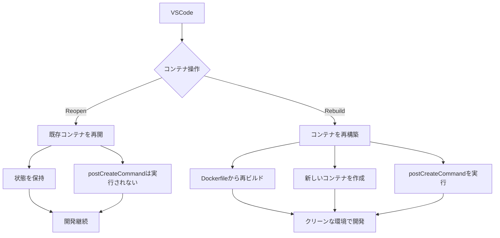
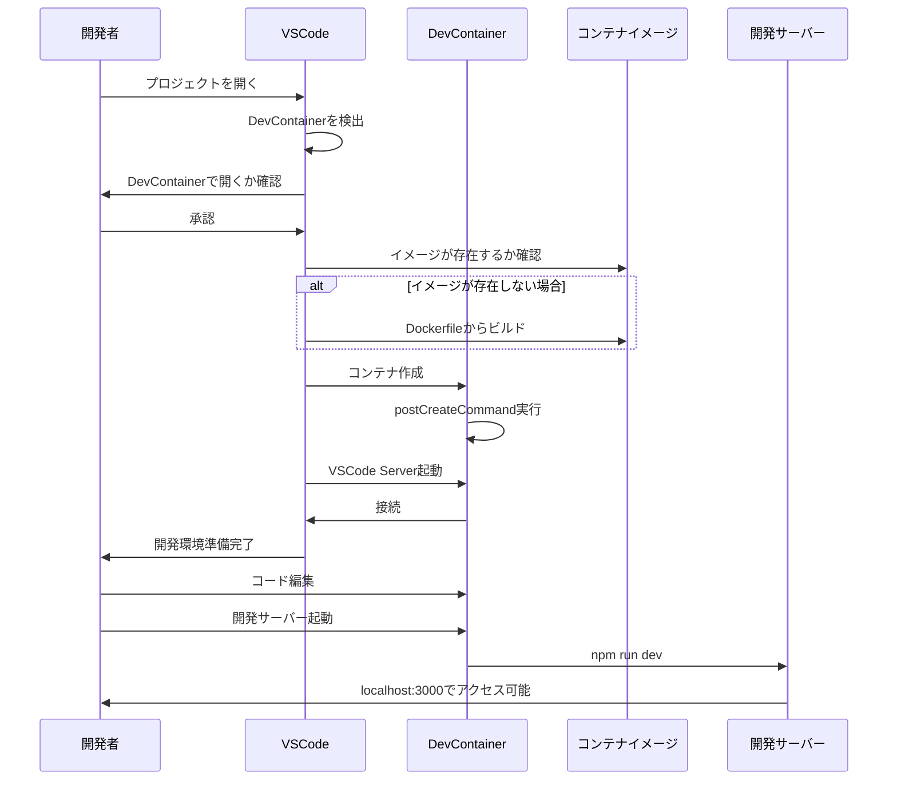

# 開発コンテナ（DevContainer）環境の解説

## 目次

- [概要](#概要)
- [1. Dockerfile](#1-dockerfile)
  - [基本環境の設定](#基本環境の設定)
  - [ディレクトリとユーザー設定](#ディレクトリとユーザー設定)
  - [コンテナ起動設定](#コンテナ起動設定)
- [2. docker-compose.yml](#2-docker-composeyml)
  - [基本設定](#基本設定)
  - [docker-compose.ymlの位置づけ](#docker-composeymlの位置づけ)
  - [Dockerfileとdocker-compose.ymlの役割の違い](#dockerfileとdocker-composeymlの役割の違い)
  - [コマンド重複の理由](#コマンド重複の理由)
- [3. devcontainer.json](#3-devcontainerjson)
  - [基本設定](#基本設定-1)
  - [VSCode固有の設定](#vscode固有の設定)
  - [環境設定](#環境設定)
- [各設定の詳細解説](#各設定の詳細解説)
  - [postCreateCommand](#postcreatecommand)
  - [remoteUser](#remoteuser)
  - [Dockerfileのグローバルパッケージとdevcontainerの違い](#dockerfileのグローバルパッケージとdevcontainerの違い)
  - [コンテナの永続化](#コンテナの永続化)
  - [ファイル権限の設定](#ファイル権限の設定)
  - [コンテナの再開と再構築](#コンテナの再開と再構築)
- [IaC (Infrastructure as Code) としての側面](#iac-infrastructure-as-code-としての側面)
- [開発サーバーとの関係](#開発サーバーとの関係)
- [開発フロー](#開発フロー)
- [DevContainerセットアップチェックリスト](#devcontainerセットアップチェックリスト)
- [まとめ](#まとめ)

## 概要

開発コンテナとは、VSCodeで開発を行うための一貫した環境をDockerを使って提供する仕組みです。以下の3つの主要ファイルによって階層的に構成されています：

- **Dockerfile**: コンテナのOS環境とシステムレベルの設定を定義（基盤レイヤー）
- **docker-compose.yml**: 複数コンテナの構成と連携を定義（アーキテクチャレイヤー）
- **devcontainer.json**: VSCodeの開発環境とプロジェクト固有の設定を定義（IDE連携レイヤー）

これらは階層構造を成しており、下位レイヤーが上位レイヤーの基盤となります：
1. Dockerfileでイメージ（設計図）を定義
2. docker-compose.ymlでイメージからコンテナを作成・実行し連携を設定
3. devcontainer.jsonでVSCodeとコンテナの統合環境を構築し、**コンテナ内をVSCodeから直接操作可能に**

これらは合わせて「開発環境のIaC（Infrastructure as Code）」を実現しています。

## 1. Dockerfile

このファイルはコンテナの基本環境を定義します：

```dockerfile
FROM node:18

# 必要なツールのインストール
RUN apt-get update && \
    apt-get install -y git curl wget gnupg nano vim && \
    apt-get clean && \
    rm -rf /var/lib/apt/lists/*

# グローバルパッケージのインストール
RUN npm install -g next typescript ts-node 

WORKDIR /workspace/frontend

# 作業ディレクトリの所有権をnodeユーザーnodeグループに設定
RUN mkdir -p /workspace/frontend/node_modules && \
    chown -R node:node /workspace && \
    chmod -R 775 /workspace

USER node

# コンテナ内での実行コマンド
CMD ["sleep", "infinity"]
```

### 基本環境の設定
- `FROM node:18`: ベースイメージとしてNode.js 18（Debian Linux上）を使用。
- `apt-get install`: Linuxの開発ツールをインストール（git, curl, vim等）。
- `apt-get clean` と `rm -rf /var/lib/apt/lists/*`: パッケージインストール後の不要なキャッシュとインデックスファイルを削除してイメージサイズを最小化。
- `npm install -g`: フロントエンド開発ツールをグローバルにインストール。

### ディレクトリとユーザー設定
- `WORKDIR /workspace/frontend`: コンテナ内の作業ディレクトリを設定。以降のすべてのコマンド（RUN, CMD, COPY等）はこのディレクトリを基準に実行される。
- `mkdir -p`: 必要なディレクトリ構造を再帰的に作成。
- `chown -R node:node`: ディレクトリの所有者をnodeユーザーとnodeグループに設定。Unix/Linuxシステムのファイル所有権の基本的な書式は「所有者:グループ」という形式。
- `chmod -R 775`: ディレクトリに適切な権限を設定（所有者とグループに読み書き実行権限、その他のユーザーに読み取りと実行権限）。
- `USER node`: 非rootユーザーとして実行（セキュリティのベストプラクティス）。

#### パスの指定について
`WORKDIR /workspace/frontend`を設定した後でも、`mkdir -p /workspace/frontend/node_modules`では絶対パスを使用しています。以下の点が重要です：

- 絶対パス（`/`で始まる）はWORKDIRに関係なく常に指定した場所にディレクトリを作成します
- 相対パス（例：`mkdir -p node_modules`）の場合はWORKDIR以下に作成されます
- このケースでは`mkdir -p node_modules`としても同じ結果になりますが、明示的に絶対パスを使うことで可読性が向上します

#### nodeユーザーについて
`chown -R node:node /workspace`は、rootユーザーとrootグループに与えられていた所有権をnodeユーザーとnodeグループに付け替える操作です：

- nodeユーザーは手動で作成する必要はありません。`FROM node:18`で使用している公式Node.jsイメージにデフォルトで含まれています
- これはセキュリティのベストプラクティスの一部で、コンテナ内の操作を非root権限で行うためのものです
- 最初にroot権限で必要なセットアップを行った後、`USER node`コマンドで通常操作を制限された権限で実行します
- ほとんどの開発用途では、公式イメージで提供されているnodeユーザーで十分です
- 特定のセキュリティ要件がある場合のみ、カスタムユーザーの作成を検討すると良いでしょう

### コンテナ起動設定
- `CMD ["sleep", "infinity"]`: コンテナを常に起動状態に保つためのコマンド。コンテナ起動時に実行され、これによりコンテナがバックグラウンドで動作し続ける。

## 2. docker-compose.yml

このファイルは複数のコンテナサービスを一元管理（複数のコンテナをどのように起動し、どのように連携させるか）し、それらの関係性を定義します：

```yaml
version: '3.8'

services:
  frontend:
    build: 
      context: .
      dockerfile: ./frontend/.devcontainer/Dockerfile
    volumes:
      - .:/workspace:cached
      - frontend_node_modules:/workspace/frontend/node_modules
    command: sleep infinity
    environment:
      - NODE_ENV=development
      - NEXT_PUBLIC_OPENAI_API_KEY=
    ports:
      - "3000:3000"
    networks:
      - mailcraft-network
    user: node

networks:
  mailcraft-network:
    driver: bridge

volumes:
  frontend_node_modules: 
```

### 基本設定
- `version`: Docker Composeファイルのバージョンを指定。バージョンによって機能や構文が異なります。
- `services`: アプリケーションを構成する各コンテナサービスを定義。ここでは`frontend`という名前の単一サービスが定義されています。
- `networks`: コンテナ間の通信に使用されるネットワークを定義。`mailcraft-network`という名前のブリッジネットワークを作成しています。
- `volumes`: 名前付きボリュームを定義。`frontend_node_modules`という名前のボリュームを作成しています。

### サービス設定の詳細
#### ビルド設定
- `build`: Dockerfileからイメージを構築するための設定。
  - `context: .`: ビルドコンテキストとしてプロジェクトルートディレクトリを指定。これにより、Dockerfileからプロジェクト全体にアクセス可能になります。
  - `dockerfile: ./frontend/.devcontainer/Dockerfile`: 使用するDockerfileのパスを指定。プロジェクトルートからの相対パスで指定します。

#### ボリューム設定
- `volumes`: ホストとコンテナ間のディレクトリマッピング。
  - `.:/workspace:cached`: プロジェクトルート全体をコンテナ内の`/workspace`にマウント。`:cached`オプションはホストからコンテナへの読み取りパフォーマンスを優先し、I/O操作を最適化します。
  - `frontend_node_modules:/workspace/frontend/node_modules`: 名前付きボリューム`frontend_node_modules`をコンテナの`node_modules`ディレクトリにマウント。これにより、依存関係のインストールをコンテナ内に保持し、ホストのファイルシステムとの競合を避け、パフォーマンスを向上させます。

#### 実行設定
- `command: sleep infinity`: コンテナ起動時に実行するコマンド。
  - Dockerfileの`CMD`指示を上書きします。
  - `sleep infinity`は、コンテナを常に起動状態に保つための無限ループコマンド。
  - DevContainerでは、コンテナが実行中である必要があるため、このコマンドが重要です。

#### 環境変数設定
- `environment`: コンテナ内で使用する環境変数を設定。
  - `NODE_ENV=development`: Node.jsアプリケーションの実行モードを開発モードに設定。
  - `NEXT_PUBLIC_OPENAI_API_KEY=`: OpenAI APIのキーを設定するための変数（値は空で定義）。

#### ネットワーク設定
- `ports`: ホストとコンテナのポートマッピング。
  - `"3000:3000"`: ホストの3000ポートをコンテナの3000ポートに転送。
  - これにより、ホストマシンのブラウザから`localhost:3000`でコンテナ内で実行されているwebアプリケーションにアクセス可能。
- `networks`: このサービスが接続するネットワークを指定。
  - `mailcraft-network`: 他のサービスとの通信に使用するカスタムネットワーク。
  - 複数コンテナ間の連携が必要な場合、共通のネットワークに接続することで相互通信が可能になります。

#### ユーザー設定
- `user: node`: コンテナ内でプロセスを実行するユーザーを指定。
  - Dockerfileの`USER node`指示と一貫性を保ち、非root権限でコンテナを実行するセキュリティベストプラクティスを実現。
  - これにより、Dockerfileと同じユーザー権限でコンテナが実行されることを保証します。

### ネットワーク定義
- `networks`: プロジェクト全体で使用するネットワークを定義。
  - `mailcraft-network`: ネットワーク名。
  - `driver: bridge`: ネットワークタイプとしてブリッジを使用。これはコンテナ間通信の最も一般的な方法で、同一ホスト上のコンテナが相互に通信できるようにします。

### ボリューム定義
- `volumes`: 名前付きボリュームを定義。
  - `frontend_node_modules`: node_modulesディレクトリを保存するための永続ボリューム。
  - 名前付きボリュームを使用することで、コンテナの再作成後もインストールされたパッケージが保持され、再インストールの時間を節約できます。
  - また、node_modulesのような大量の小さなファイルをホストのファイルシステムから分離することで、パフォーマンスが向上します。

### docker-compose.ymlの位置づけ
- **階層構造**: DockerfileとdevcontainerJSONの間の中間層（アーキテクチャレイヤー）
- **役割**: イメージからコンテナを作成・起動し、複数コンテナの連携を定義
- **実行タイミング**: `docker-compose up`コマンドまたはVSCodeのDevContainer起動時

### Dockerfileとdocker-compose.ymlの役割の違い
- **Dockerfile**: イメージを「定義・構築」するためのもの（設計図を作成）
- **docker-compose.yml**: イメージから「コンテナを作成・実行」するもの（設計図を元に実際の構造物を建設）
- docker-compose.ymlを利用せずにDockerfileのみで開発コンテナを構築することも可能（専用のコマンドを使用する）

### コマンド重複の理由
Dockerfileの`CMD ["sleep", "infinity"]`とdocker-composeの`command: sleep infinity`は同様の目的を持ちますが、次の理由で重複して定義されています：

1. 異なる実行コンテキスト（Dockerfile単体での使用とdocker-compose環境での使用）に対応するため
2. DevContainerを単一Dockerfileのみで使用する場合のフォールバック設定として
3. コンテナを常に起動状態に保つために両環境でも確実に設定するため

### 複数サービスの連携
Docker Composeの主要な利点は、複数のサービス（コンテナ）を一元管理できることです：

- フロントエンド、バックエンド、データベースなど複数のサービスを同時に定義・起動
- サービス間の依存関係を管理（例：`depends_on`で起動順序を制御）
- 共通ネットワークを通じてサービス間の通信を自動設定
- 環境変数やシークレットの共有・管理

これにより、マイクロサービスアーキテクチャや複雑な開発環境をコード化して管理することが可能になります。

## 3. devcontainer.json

このファイルはVSCodeの開発コンテナ機能のための設定ファイルです。主な設定項目の解説を以下に示します：

```json
{
  "name": "MailCraft AI Frontend",
  "dockerComposeFile": ["../../docker-compose.yml"],
  "service": "frontend",
  "workspaceFolder": "/workspace/frontend",
  "customizations": {
    "vscode": {
      "extensions": [
        "dbaeumer.vscode-eslint",
        "esbenp.prettier-vscode",
        "bradlc.vscode-tailwindcss",
        "dsznajder.es7-react-js-snippets",
        "ms-vscode.vscode-typescript-next"
      ],
      "settings": {
        "editor.formatOnSave": true,
        "editor.defaultFormatter": "esbenp.prettier-vscode",
        "editor.codeActionsOnSave": {
          "source.fixAll.eslint": true
        },
        "typescript.tsdk": "node_modules/typescript/lib",
        "tailwindCSS.includeLanguages": {
          "typescript": "javascript",
          "typescriptreact": "javascript"
        }
      }
    }
  },
  "forwardPorts": [3000],
  "postCreateCommand": "npm install",
  "remoteUser": "node"
}
```

### 基本設定
- `name`: コンテナの名前。VSCodeのリモートコンテナリストに表示される。
- `dockerComposeFile`: 使用するDocker Composeファイルのパス。
- `service`: Docker Composeファイル内のどのサービスに接続するか。
- `workspaceFolder`: コンテナ内のプロジェクトの作業ディレクトリ。

### VSCode固有の設定
- `customizations.vscode.extensions`: 自動的にインストールされるVSCode拡張機能。
  - コード品質ツール（ESLint, Prettier）
  - フレームワークサポート（Tailwind CSS, React）
  - 言語サポート（TypeScript）
- `customizations.vscode.settings`: VSCodeのエディタ設定（settings.jsonと同等）。
  - 保存時の自動フォーマット設定
  - デフォルトフォーマッタの設定
  - TypeScriptの設定
  - CSS言語サポートの設定

### 環境設定
- `forwardPorts`: コンテナからホストに転送するポート（ブラウザでアクセスするため）。
- `postCreateCommand`: コンテナ作成後に実行するコマンド（プロジェクト依存関係のインストール）。
- `remoteUser`: コンテナ内で使用するユーザー名。

## 各設定の詳細解説

### postCreateCommand
- `"postCreateCommand": "npm install"`: コンテナ作成後に一度だけ実行されるコマンド。
- 初めてコンテナを作成した時や、再ビルドした時に実行される。
- 毎回コンテナを起動するたびに実行されるわけではない。
- プロジェクト依存関係（package.jsonに記載）をインストールするために使用。

### remoteUser
- `"remoteUser": "node"`: コンテナ内で操作するユーザー名。
- Node.jsの公式Dockerイメージに含まれている非rootユーザー。
- セキュリティ上の理由からrootユーザーではなく制限されたユーザーを使用。

### Dockerfileのグローバルパッケージとdevcontainerの違い
- Dockerfile (`npm install -g`): システム全体で使用するツールをインストール。
- devcontainer (`postCreateCommand`): プロジェクト固有の依存関係をインストール。

### コンテナの永続化
- `CMD ["sleep", "infinity"]`: コンテナを終了せずに稼働し続けるためのコマンド。
- Dockerコンテナはメインプロセスが終了すると自動的に停止するため、これによりコンテナを継続的に実行。

### ファイル権限の設定
```
RUN mkdir -p /workspace/frontend/node_modules && \
    chown -R node:node /workspace && \
    chmod -R 775 /workspace
```
- `mkdir -p`: 必要なディレクトリ構造を作成。
- `chown`: ディレクトリの所有者をnodeユーザーとnodeグループに設定。
- `chmod`: 適切な権限を設定（所有者とグループには書き込み権限、その他のユーザーには読み取り権限）。

### コンテナの再開と再構築



- **Reopen**: 既存のコンテナを再開。設定は保持され、`postCreateCommand`は実行されない。
- **Rebuild and Reopen**: コンテナを再構築。Dockerfileから再ビルドし、`postCreateCommand`も再実行される。

## IaC (Infrastructure as Code) としての側面

- Dockerfileは「OSレベルの前提環境」のIaC
- devcontainer.jsonは「開発のための前提環境」のIaC
- これらを組み合わせることで、コードで開発環境を定義・管理できる
- チーム全体で一貫した開発環境を実現し、「動かない」問題を解消

## 開発サーバーとの関係

開発サーバー（npm run dev等）は、通常以下のように扱われます：

1. 基本的には手動で起動（フレキシビリティを確保）
2. 必要に応じて `postStartCommand` で自動起動も可能
3. デバッグ実行時にはデバッグ設定に従い起動
4. `forwardPorts` 設定によりホストからアクセス可能

## 開発フロー



## DevContainerセットアップチェックリスト

以下は新しいプロジェクトでDevContainerを設定する際のチェックリストです：

- [ ] `.devcontainer`ディレクトリを作成
- [ ] `devcontainer.json`の作成
  - [ ] 適切な名前の設定
  - [ ] Docker Composeファイルの指定（または直接Dockerfileの指定）
  - [ ] 作業ディレクトリの設定
  - [ ] 必要なVSCode拡張機能の指定
  - [ ] VSCodeの設定の指定
  - [ ] 転送ポートの設定
  - [ ] postCreateCommandの設定
  - [ ] リモートユーザーの設定
- [ ] `Dockerfile`の作成
  - [ ] 適切なベースイメージの選択
  - [ ] 必要なシステムツールのインストール
  - [ ] グローバルパッケージのインストール
  - [ ] 作業ディレクトリの設定
  - [ ] 適切な権限設定
  - [ ] 非rootユーザーの使用
- [ ] `.gitignore`に`node_modules`などの不要ファイルを追加
- [ ] チームメンバーへの共有と利用方法の説明

## まとめ

DevContainerは、「環境構築」と「開発体験」を一貫性を持って提供する強力なツールです。「環境が違うから動かない」という問題を解決し、新メンバーのオンボーディングを簡単にします。 